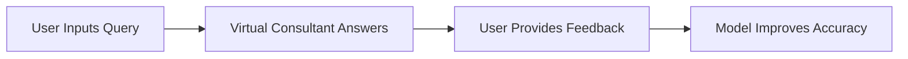
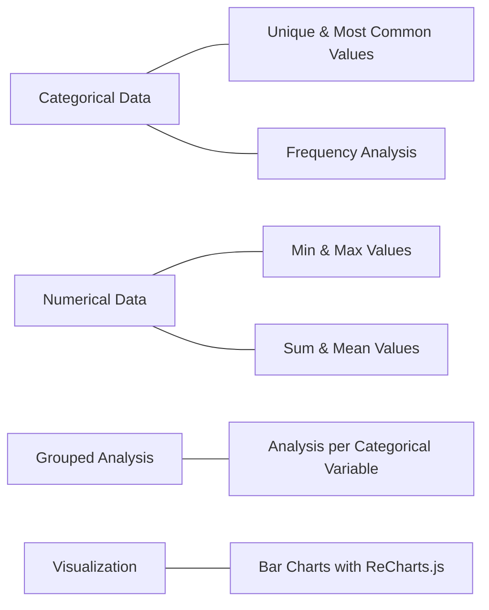
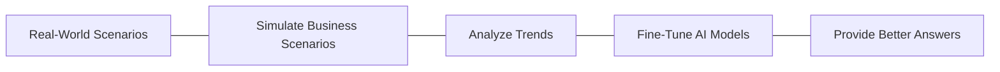
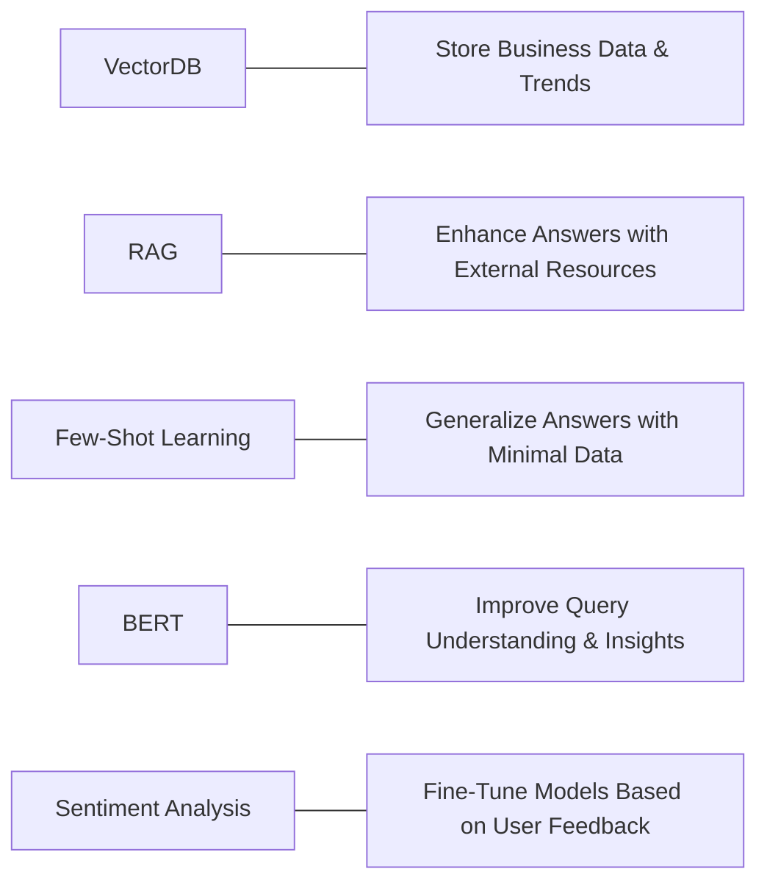
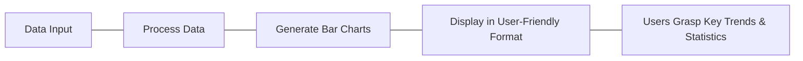
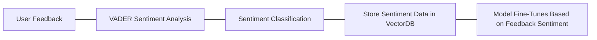

# DecisivAI: Business Decision-Making Platform

DecisivAI is an AI-powered platform designed to help businesses make informed decisions through data analysis, scenario simulation, and interactive insights. This platform integrates advanced machine learning models, natural language processing, and real-time business data visualization to empower enterprises with actionable insights.

## Introduction 

As businesses navigate increasingly complex environments, leveraging AI to make informed decisions is becoming essential. Studies show that:

- **97%** of companies believe AI will help their business.
- **46%** have already begun using AI in some capacity.
- **64%** of companies recognize that AI can improve customer relationships.

These statistics highlight the critical role AI will play in decision-making in the coming years. Traditional methods for business decision-making are likely to fall short in this new landscape, as the sheer volume of data and the need for timely insights outpace human analysis capabilities.

### Key Points:

- **AI & Large Language Models (LLMs)**: LLMs, such as the models used in DecisivAI, have the potential to process vast quantities of company data, providing valuable insights that drive business strategies and operations.
  
- **RAG (Retrieval-Augmented Generation)**: This model refines the decision-making process by combining external knowledge with AI's ability to retrieve relevant, real-time data. It enables the system to generate accurate insights, tailored to specific business contexts.

By utilizing these cutting-edge technologies, **DecisivAI** empowers businesses to stay ahead of the competition, make informed decisions faster, and foster stronger customer relationships.

## Overview

This project leverages advanced AI models, including RAG (Retrieval-Augmented Generation), Few-Shot Learning, and BERT, to provide users with a virtual consultant capable of answering queries, simulating scenarios, and providing insights based on real-world data. The system also incorporates an InsightBot for generating in-depth data analysis and an interactive dashboard for visualizing key metrics.

## Key Features

### 1. **Virtual Consultant**

| Feature             | Description                                                                                                                                  |
|---------------------|----------------------------------------------------------------------------------------------------------------------------------------------|
| Query & Answer       | Users can ask the virtual consultant business-related questions, and the system will return relevant insights.                               |
| Feedback Integration | Users can provide feedback to improve the quality of the answers over time, allowing the system to fine-tune and enhance its responses.       |

### 2. **InsightBot**

| Feature      | Description                                                                                                        |
|--------------------|----------------------------------------------------------------------------------------------------------------------------|
| **Categorical Data**| Unique values, most common values, and frequency of specific fields.                                                       |
| **Numerical Data**  | Provides minimum, maximum, sum, and mean values for numerical metrics.                                                     |
| **Grouped Analysis**   |Provides all the necessary analysis of numerical data for each categorical variable                                  |
| **Visualization**   | Integrates with ReCharts.js to display bar charts for easy data visualization.                                             |

### 3. **Scenario Simulation**

| Scenario Simulation | Description                                                                                                               |
|---------------------|---------------------------------------------------------------------------------------------------------------------------|
| Real-World Scenarios | Simulates real-world business scenarios and fine-tunes the AI models to provide better answers based on evolving trends.   |

### 4. **AI-Powered Models**

| Model              | Description                                                                                                                |
|--------------------|----------------------------------------------------------------------------------------------------------------------------|
| **VectorDB**        | Stores business-specific data and industry trends for rapid retrieval.                                                     |
| **RAG**             | Enhances the answers provided by the Virtual Consultant by leveraging external documents or resources.                      |
| **Few-Shot Learning**| Allows the model to generalize answers with minimal additional data training.                                              |
| **BERT**            | A natural language processing model that improves the system's ability to understand user queries and generate insights.    |
| **Sentiment Analysis** | Uses VADER to analyze user feedback and fine-tunes the models based on sentiment (positive, neutral, or negative).       |

### 5. **Interactive Dashboard**

| Feature              | Description                                                                                                                |
|----------------------|----------------------------------------------------------------------------------------------------------------------------|
| Visualization         | Displays bar charts to help users grasp key trends and statistics in a user-friendly format using **ReCharts.js**.          |

### 6. **Sentiment Analysis for Feedback**

| Feature              | Description                                                                                                                |
|----------------------|----------------------------------------------------------------------------------------------------------------------------|
| Sentiment Analysis         | Uses the VADER sentiment analysis model to gauge the emotional tone of user feedback (positive, neutral, or negative).          |
| VectorDB Integration       | Passes the analyzed sentiment data into the VectorDB to fine-tune and improve the AI models based on user responses.            |

## Solution Overview

## Project Architecture

## How It Works

| **Step**            | **Description**                                                                                                                                                       |
|---------------------|-----------------------------------------------------------------------------------------------------------------------------------------------------------------------|
| **Input**           | Users provide data related to the business, including sales, customer, inventory, and marketing data. This data is stored in the VectorDB.                              |
| **Model Interaction**| The AI model, fine-tuned through feedback and scenario simulations, retrieves relevant data from the VectorDB and applies RAG, Few-Shot Learning, and BERT to generate precise answers and insights. |
| **Data Categorization** | The InsightBot processes the input data, splitting it into categorical and numerical values.                                                                         |
| **Grouped Analysis** | The categorized data is used to calculate the minimum, maximum, average, and sum of each numerical column for individual categorical data. The calculated data is then stored in the VectorDB. |
| **Insights Generation** | The system presents the output in a tabular format and interactive bar charts on the dashboard.                                                                        |
| **Feedback Loop**   | Users can provide feedback to enhance the model's performance, leading to better results in the future.                                                                  |

## Technology Stack

## Technology Comparison of DecisivAI with other alternatives

## Key Benefits of Our AI-Powered Decision-Making Platform

