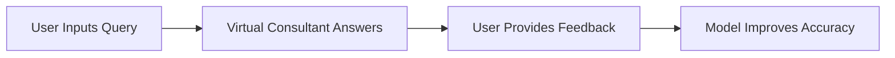
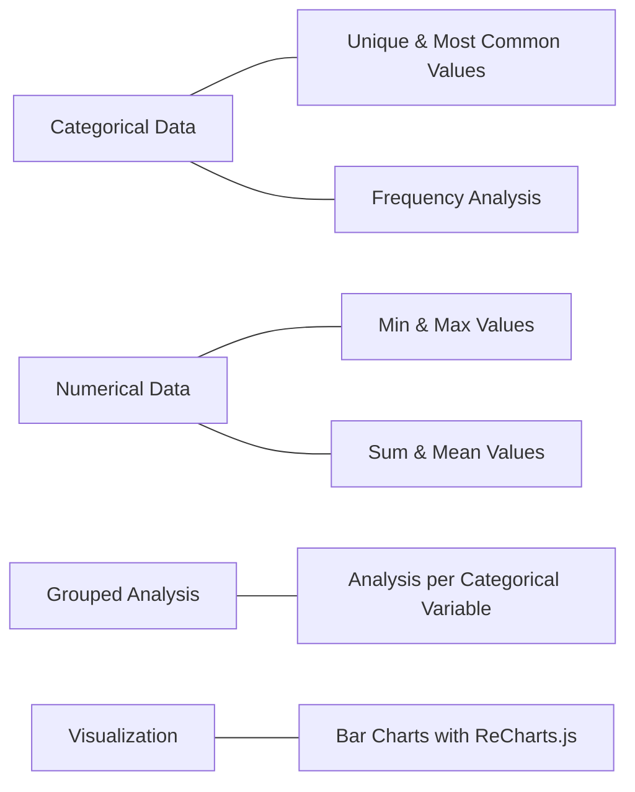
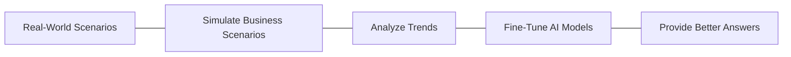
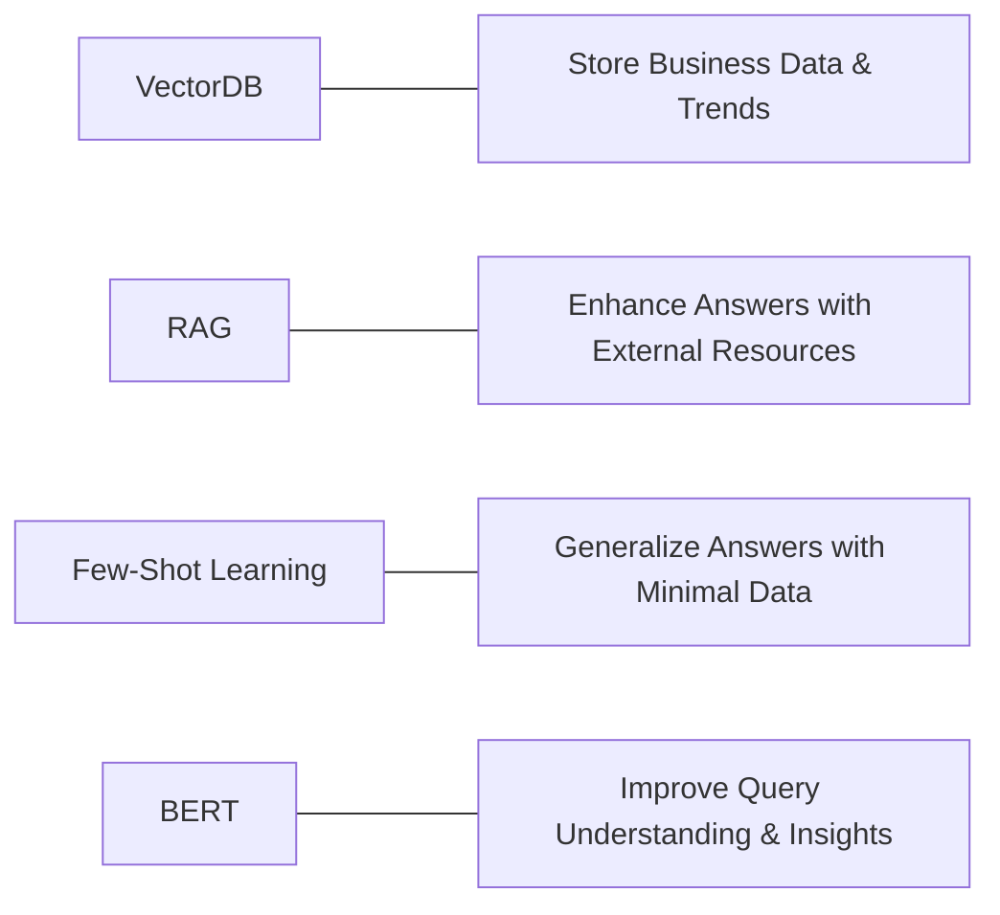
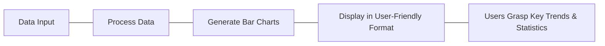

# DecisivAI: Business Decision-Making Platform

DecisivAI is an AI-powered platform designed to help businesses make informed decisions through data analysis, scenario simulation, and interactive insights. This platform integrates advanced machine learning models, natural language processing, and real-time business data visualization to empower enterprises with actionable insights.

## Introduction 

As businesses navigate increasingly complex environments, leveraging AI to make informed decisions is becoming essential. Studies show that:

- **97%** of companies believe AI will help their business.
- **46%** have already begun using AI in some capacity.
- **64%** of companies recognize that AI can improve customer relationships.

These statistics highlight the critical role AI will play in decision-making in the coming years. Traditional methods for business decision-making are likely to fall short in this new landscape, as the sheer volume of data and the need for timely insights outpace human analysis capabilities.

### Key Points:

- **AI & Large Language Models (LLMs)**: LLMs, such as the models used in DecisivAI, have the potential to process vast quantities of company data, providing valuable insights that drive business strategies and operations.
  
- **RAG (Retrieval-Augmented Generation)**: This model refines the decision-making process by combining external knowledge with AI's ability to retrieve relevant, real-time data. It enables the system to generate accurate insights, tailored to specific business contexts.

By utilizing these cutting-edge technologies, **DecisivAI** empowers businesses to stay ahead of the competition, make informed decisions faster, and foster stronger customer relationships.

## Overview

This project leverages advanced AI models, including RAG (Retrieval-Augmented Generation), Few-Shot Learning, and BERT, to provide users with a virtual consultant capable of answering queries, simulating scenarios, and providing insights based on real-world data. The system also incorporates an InsightBot for generating in-depth data analysis and an interactive dashboard for visualizing key metrics.

## Key Features

### 1. **Virtual Consultant**

| Feature             | Description                                                                                                                                  |
|---------------------|----------------------------------------------------------------------------------------------------------------------------------------------|
| Query & Answer       | Users can ask the virtual consultant business-related questions, and the system will return relevant insights.                               |
| Feedback Integration | Users can provide feedback to improve the quality of the answers over time, allowing the system to fine-tune and enhance its responses.       |

### 2. **InsightBot**

| Feature      | Description                                                                                                        |
|--------------------|----------------------------------------------------------------------------------------------------------------------------|
| **Categorical Data**| Unique values, most common values, and frequency of specific fields.                                                       |
| **Numerical Data**  | Provides minimum, maximum, sum, and mean values for numerical metrics.                                                     |
| **Grouped Analysis**   |Provides all the necessary analysis of numerical data for each categorical variable                                  |
| **Visualization**   | Integrates with ReCharts.js to display bar charts for easy data visualization.                                             |

### 3. **Scenario Simulation**

| Scenario Simulation | Description                                                                                                               |
|---------------------|---------------------------------------------------------------------------------------------------------------------------|
| Real-World Scenarios | Simulates real-world business scenarios and fine-tunes the AI models to provide better answers based on evolving trends.   |

### 4. **AI-Powered Models**

| Model              | Description                                                                                                                |
|--------------------|----------------------------------------------------------------------------------------------------------------------------|
| **VectorDB**        | Stores business-specific data and industry trends for rapid retrieval.                                                     |
| **RAG**             | Enhances the answers provided by the Virtual Consultant by leveraging external documents or resources.                      |
| **Few-Shot Learning**| Allows the model to generalize answers with minimal additional data training.                                              |
| **BERT**            | A natural language processing model that improves the system's ability to understand user queries and generate insights.    |

### 5. **Interactive Dashboard**

| Feature              | Description                                                                                                                |
|----------------------|----------------------------------------------------------------------------------------------------------------------------|
| Visualization         | Displays bar charts to help users grasp key trends and statistics in a user-friendly format using **ReCharts.js**.          |

## Project Architecture

## How It Works

1. **Input**: Users provide data related to the business, including sales, customer, inventory, and marketing data. Further, this data gets stored in the VectorDB.
2. **Model Interaction**:
   - The AI model, fine-tuned through feedback and scenario simulations, retrieves relevant data from the VectorDB and applies RAG, Few-Shot Learning, and BERT to generate precise answers and insights.
3. **Data Categorization**: The InsightBot processes the input data, splitting it into categorical and numerical values.
4. **Grouped Analysis**: The categorized data is then used to calculate the minimum, maximum, average and sum of each numerical column for individual categorical data. This calcualted data is again stored into the VectorDB. 
5. **Insights Generation**: The system presents the output in a tabular format and interactive bar charts on the dashboard.
6. **Feedback Loop**: Users can provide feedback to enhance the model's performance, leading to better results in the future.

## Technology Stack

| Technology        | Description                                                                                                                     |
|-------------------|---------------------------------------------------------------------------------------------------------------------------------|
| **Frontend**       | React.js, JavaScript                                                                                                           |
| **Backend**        | Flask, Python                                                                                                                  |
| **AI Models**      | RAG, LangChain, BERT                                                                                                           |
| **Database**       | VectorDB                                                                                                                       |
| **Data Visualization**| ReCharts.js                                                                                                                 |

## Detailed Explanation of why we preferred these specific Technologies

| **Technology**         | **Purpose**                                                                                           | **Why We Chose It**                                                                                                                 |
|------------------------|-------------------------------------------------------------------------------------------------------|-------------------------------------------------------------------------------------------------------------------------------------|
| **RAG (Retrieval-Augmented Generation)** | To enhance the AI's ability to retrieve relevant information from business-specific documents and industry trends.            | Combines **document retrieval** with **natural language understanding**, ensuring **contextual relevance** for business decision-making. |
| **Few-Shot Learning**  | Enables the AI to generalize insights with minimal training data.                                      | Allows the model to **adapt quickly** to new business scenarios without the need for extensive data, offering **scalability** and **flexibility**. |
| **BERT (Bidirectional Encoder Representations from Transformers)** | Improves the understanding of user queries and enhances NLP capabilities.                          | **BERT’s bidirectional processing** provides a deeper understanding of user queries, resulting in **more accurate insights** from business data. |
| **VectorDB (ChromaDB)**| Stores vectorized business-specific data for efficient retrieval during insights and query processing.  | **Optimized for AI-driven retrieval**, allowing fast access to complex data points, ideal for real-time business decision-making.   |
| **ReCharts.js**        | Used for creating dynamic and interactive visualizations on the dashboard.                             | **Lightweight, flexible**, and well-suited for React-based applications, ReCharts.js allows **real-time data visualization** with minimal performance overhead. |
| **Flask (Backend)**    | Handles backend operations, API endpoints, and integrates with AI models.                             | **Lightweight and highly customizable**, Flask is ideal for building **scalable, API-driven applications** with **low latency** for real-time responses. |
| **React.js (Frontend)**| Powers the interactive and responsive user interface for the dashboard and query input.                | **Component-based structure**, easy state management, and fast rendering make React.js ideal for building **dynamic, real-time UIs**. |
| **LangChain**          | To manage complex LLM operations and enable seamless communication between the AI models and data.     | **Specialized for LLM orchestration**, LangChain simplifies the process of integrating **multiple AI models** and managing **complex workflows**. |

## Technology Comparison of DecisivAI with other alternatives

| **Technology**         | **DecisivAI Approach**                                               | **Alternative Solutions**                                      | **Key Advantages of DecisivAI**                                 |
|------------------------|---------------------------------------------------------------------|----------------------------------------------------------------|----------------------------------------------------------------|
| **AI Model**           | RAG (Retrieval-Augmented Generation), Few-Shot Learning, BERT       | Traditional Machine Learning Models                            | Combines **real-time data retrieval** with **contextual accuracy** and minimal data training. |
| **Data Storage**       | VectorDB for fast retrieval of business-specific data               | Relational Databases (SQL), NoSQL Databases (MongoDB)           | Optimized for **vector-based search** and **real-time insights** from complex business datasets. |
| **Insight Delivery**    | InsightBot with ReCharts.js for real-time, interactive visualizations | Static Reporting Dashboards (Power BI, Tableau)                | Provides **dynamic insights** with **custom simulations** and real-time feedback integration. |
| **Scenario Simulation** | AI-driven scenario simulation for predictive analysis              | Manual scenario planning or rule-based simulations (Excel)      | Offers **AI-powered predictions** with **data-driven scenarios**, eliminating guesswork. |

## Impact & Benefits

